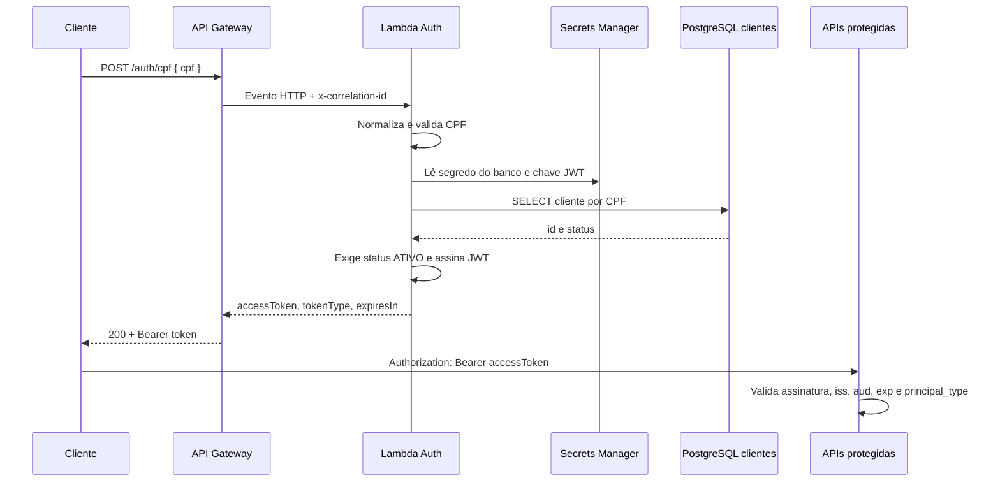
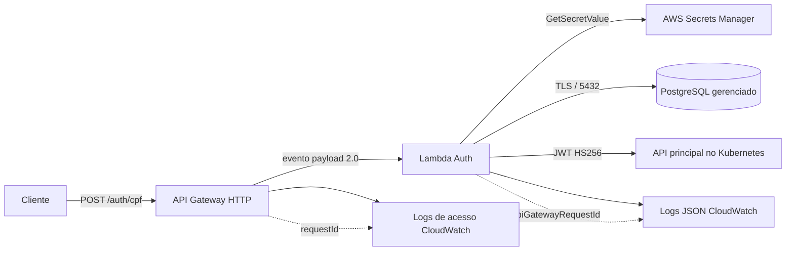

# Auth Serverless — FIAP SOAT Mecânica

Função AWS Lambda que autentica clientes pelo CPF. Ela recebe o CPF no API Gateway, valida e normaliza o valor, consulta o cliente na tabela `clientes` do PostgreSQL e emite um JWT somente quando o cliente existe e está `ATIVO`.

Este é o repositório exclusivo da Function Serverless de autenticação exigida no Tech Challenge — Fase 3. A API de oficina, a infraestrutura compartilhada de banco/VPC e a observabilidade do grupo continuam em seus próprios repositórios e precisam ser integradas conforme os contratos abaixo.

## Tecnologias

- Java 21 e AWS Lambda (`RequestHandler`)
- API Gateway HTTP API, payload 2.0
- PostgreSQL via JDBC
- AWS Secrets Manager
- JJWT com HMAC SHA-256
- Terraform e GitHub Actions com OIDC para AWS
- CloudWatch Logs em JSON

## Fluxo



O endpoint é deliberadamente público, pois é a porta de emissão do token. As demais rotas sensíveis pertencem à API principal e devem validar o token; a Lambda não protege uma rota que ela não atende.

## Componentes e responsabilidades



O `requestId` do API Gateway é registrado pelo estágio e pela Lambda como `apiGatewayRequestId`. Assim, ele permite correlacionar os logs dos dois componentes. Quando o cliente envia `x-correlation-id`, a Lambda o devolve na resposta e registra esse identificador separadamente, para a correlação entre serviços.

## Contrato HTTP

Consulte [openapi.yaml](openapi.yaml). O endpoint é `POST /auth/cpf`.

```json
{
  "cpf": "529.982.247-25"
}
```

Em sucesso:

```json
{
  "accessToken": "<JWT>",
  "tokenType": "Bearer",
  "expiresIn": 3600
}
```

O CPF pode conter pontuação. A função remove caracteres não numéricos, exige 11 dígitos, rejeita sequências repetidas e aplica os dois dígitos verificadores. CPF inválido retorna `400`. Cliente ausente ou com status diferente de `ATIVO` retorna o mesmo `401 ACCESS_DENIED`, sem revelar qual condição falhou. Falha de consulta retorna `503`.

Todas as respostas trazem `x-correlation-id`; envie esse cabeçalho para propagar a correlação entre serviços.

## Contrato JWT para a aplicação principal

A aplicação protegida deve usar a **mesma chave base64** armazenada no segredo JWT e exigir os seguintes campos:

| Campo | Valor |
| --- | --- |
| algoritmo | `HS256` |
| `sub` | UUID do cliente; nunca CPF |
| `principal_type` | `CLIENTE` |
| `iss` | valor de `JWT_ISSUER` (padrão `fiap-soat-mecanica-auth`) |
| `aud` | valor de `JWT_AUDIENCE` |
| `iat`, `exp`, `jti` | presentes; expiração padrão de 3600 segundos |

A validação deve verificar assinatura, `exp`, `iss`, `aud` e `principal_type=CLIENTE` antes de liberar qualquer rota de cliente. O filtro JWT atual da aplicação usa assunto por e-mail para usuários internos; ele precisa ser adaptado para reconhecer este principal de cliente sem transformar um UUID em e-mail. Essa mudança é uma dependência de integração no repositório da aplicação.

## Segredos e rede

No runtime, a Lambda recebe apenas ARNs em variáveis de ambiente. Os valores são lidos do AWS Secrets Manager e não devem ser incluídos em arquivo, log, token ou GitHub Actions.

O segredo do banco deve ser um JSON com este formato:

```json
{
  "host": "endpoint-do-postgres",
  "port": 5432,
  "dbname": "mecanica",
  "username": "usuario_da_lambda",
  "password": "senha"
}
```

O segredo JWT deve ser um JSON com a chave HMAC codificada em Base64:

```json
{
  "secret": "chave-hmac-base64-com-pelo-menos-256-bits"
}
```

A Lambda deve estar em subnets privadas com security group que permita somente TCP/5432 até o banco. Como o código lê Secrets Manager na execução, a VPC precisa de saída HTTPS controlada ou endpoint de interface para Secrets Manager. A política IAM concede leitura somente para os dois ARNs declarados.

## Execução local

Pré-requisitos: Java 21 e Maven 3.9+.

```powershell
mvn clean verify
```

O artefato para Lambda é `target/auth-lambda.jar`. Os testes unitários não acessam AWS nem banco. A fase `verify` também executa o JAR final em uma JVM separada: instancia o handler padrão, carrega os providers AWS/JDBC e emite e verifica um JWT com dados sintéticos. Não é necessário configurar credenciais para esses testes.

O teste do JAR pode consultar um PostgreSQL local descartável usando `AUTH_TEST_DB_PORT`; veja as instruções e os resultados em [Revisão e execução local](docs/revisao-local.md). Para chamar o Secrets Manager real, a Lambda exige credenciais e conectividade AWS, além do banco.

## Infraestrutura e deploy

O Terraform está em [infra](infra) e provisiona Lambda, API Gateway, logs, papel IAM e permissões. Requer Terraform 1.10+ para o locking nativo do backend S3. Ele recebe subnets, security groups e ARNs de segredos criados ou compartilhados por infraestrutura do grupo.

1. O responsável da infraestrutura cria uma vez o bucket S3 de state e, se aplicável, suas permissões/KMS. O bucket não é criado por este stack para evitar que o backend dependa de si próprio.
2. Copie `infra/backend.hcl.example` e `infra/terraform.tfvars.example` para arquivos locais ignorados e preencha os valores do ambiente.
3. Gere o JAR e execute Terraform:

```powershell
mvn verify
terraform -chdir=infra init -backend-config=backend.hcl
terraform -chdir=infra plan -var-file=terraform.tfvars
terraform -chdir=infra apply -var-file=terraform.tfvars
```

Não execute `apply` manualmente no fluxo normal: a implantação é automatizada pelos workflows após o merge. `homolog` implanta em `homologation` e `main` em `production`; os dois usam chaves de state diferentes. Essa separação deve ser mantida para aderir ao requisito do desafio, mesmo que o grupo faça uma primeira entrega somente em produção.

### Configuração do GitHub

Configure ambientes GitHub `homologation` e `production` e associe as variáveis/segredos a cada ambiente:

| Tipo | Nome | Uso |
| --- | --- | --- |
| Variable | `AWS_REGION` | Região AWS |
| Variable | `JWT_AUDIENCE` | Audience exigida pelas APIs |
| Variable | `PRIVATE_SUBNET_IDS_JSON` | Lista JSON de subnets privadas |
| Variable | `LAMBDA_SECURITY_GROUP_IDS_JSON` | Lista JSON de security groups da Lambda |
| Variable | `KMS_KEY_ARNS_JSON` | Lista JSON de chaves KMS, ou `[]` |
| Secret | `AWS_DEPLOY_ROLE_ARN` | Papel AWS confiado pelo OIDC do GitHub |
| Secret | `TF_STATE_BUCKET` | Bucket S3 de state já existente |
| Secret | `DB_SECRET_ARN` | ARN do segredo do banco |
| Secret | `JWT_SECRET_ARN` | ARN do segredo da chave JWT |

O workflow não usa chaves AWS estáticas: [deploy.yml](.github/workflows/deploy.yml) solicita token OIDC e assume o papel definido. O papel de deploy e a trust policy OIDC são pré-requisitos da infraestrutura compartilhada.

Ative nas configurações do repositório a proteção das branches `main` e `homolog`: pull request obrigatório, ao menos uma aprovação, checks `CI / Testar e validar Terraform` obrigatórios, conversa resolvida e sem force push/deleção. Essa configuração é feita no GitHub e não pode ser garantida por um arquivo versionado.

## Observabilidade e privacidade

A aplicação grava eventos JSON em stdout; Lambda os envia ao grupo CloudWatch. API Gateway também registra acesso JSON. Os eventos incluem `correlationId`, status e tipo de principal, mas não CPF, JWT, senha, segredo ou string de conexão. Use `x-correlation-id` no request e propague-o à API principal para correlacionar logs e traces do grupo. Para cruzar o log de acesso do API Gateway com o log da Lambda, consulte `requestId` no primeiro e `apiGatewayRequestId` no segundo.

## Documentação e demonstração

- [Contrato OpenAPI](openapi.yaml)
- [Coleção Postman](docs/postman/auth-serverless.postman_collection.json)
- [Decisão de arquitetura](docs/adr/0001-autenticacao-cpf-serverless.md)
- [Contrato de integração com a API principal](docs/integracao-api-principal.md)
- [Checklist de aceite e vídeo](docs/checklist-aceite.md)

Para a demonstração: mostre CPF válido de cliente ativo retornando JWT; CPF inválido (`400`); inexistente/inativo (`401`); uma rota protegida aceitando esse JWT e rejeitando token ausente, expirado ou inválido; execução do pipeline; recursos implantados; e logs correlacionados. Nunca exponha token ou segredo real no vídeo.
