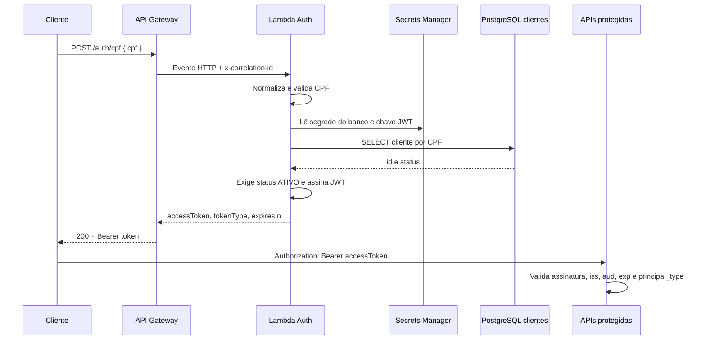
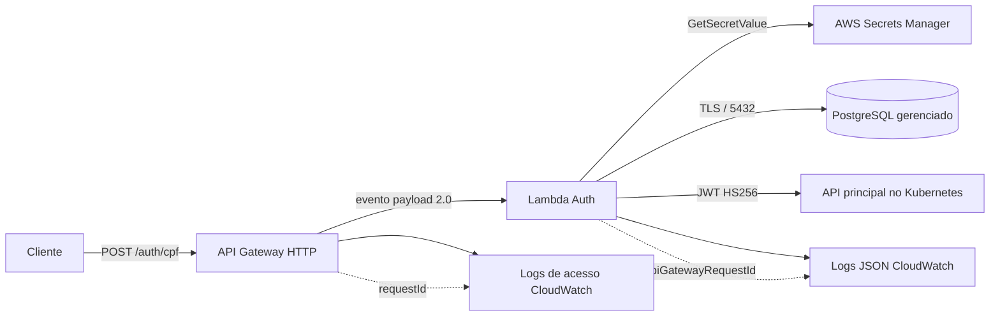

# Auth Serverless — FIAP SOAT Mecânica

Função AWS Lambda que autentica clientes pelo CPF. Ela recebe o CPF no API Gateway, valida e normaliza o valor, consulta o cliente na tabela `clientes` do PostgreSQL e emite um JWT somente quando o cliente existe e está `ATIVO`.

Este é o repositório exclusivo da Function Serverless de autenticação exigida no Tech Challenge — Fase 3. A API de oficina, a infraestrutura compartilhada de banco/VPC e a observabilidade do grupo continuam em seus próprios repositórios e precisam ser integradas conforme os contratos abaixo.

## Tecnologias

- Java 21 e AWS Lambda (`RequestHandler`)
- API Gateway HTTP API, payload 2.0
- PostgreSQL via JDBC
- AWS Secrets Manager
- JJWT com HMAC SHA-256
- Terraform e GitHub Actions para AWS Academy
- CloudWatch Logs em JSON

## Fluxo



O endpoint é deliberadamente público, pois é a porta de emissão do token. As demais rotas sensíveis pertencem à API principal e devem validar o token; a Lambda não protege uma rota que ela não atende.

## Componentes e responsabilidades



O `requestId` do API Gateway é registrado pelo estágio e pela Lambda como `apiGatewayRequestId`. Assim, ele permite correlacionar os logs dos dois componentes. Quando o cliente envia `x-correlation-id`, a Lambda o devolve na resposta e registra esse identificador separadamente, para a correlação entre serviços.

## Contrato HTTP

Consulte [openapi.yaml](openapi.yaml). O endpoint é `POST /auth/cpf`.

```json
{
  "cpf": "529.982.247-25"
}
```

Em sucesso:

```json
{
  "accessToken": "<JWT>",
  "tokenType": "Bearer",
  "expiresIn": 3600
}
```

O CPF aceita 11 dígitos ASCII ou a máscara `NNN.NNN.NNN-NN`, com espaços externos opcionais. Letras e separadores arbitrários são rejeitados. A função verifica os dois dígitos e sequências repetidas. CPF inválido retorna `400`; cliente ausente/inativo retorna o mesmo `401 ACCESS_DENIED`; falha de consulta retorna `503`. O corpo tem limite de 4096 caracteres e não aceita campos JSON duplicados. O Gateway limita a rota a 10 requisições/s, com burst de 20 (`429` quando excedido).

Todas as respostas trazem `x-correlation-id`; envie esse cabeçalho para propagar a correlação entre serviços.

## Contrato JWT para a aplicação principal

A aplicação protegida deve usar a **mesma chave base64** armazenada no segredo JWT e exigir os seguintes campos:

| Campo | Valor |
| --- | --- |
| algoritmo | `HS256` |
| `sub` | UUID do cliente; nunca CPF |
| `principal_type` | `CLIENTE` |
| `iss` | valor de `JWT_ISSUER` (padrão `fiap-soat-mecanica-auth`) |
| `aud` | valor de `JWT_AUDIENCE` |
| `iat`, `exp`, `jti` | presentes; expiração padrão de 3600 segundos |

A validação deve verificar assinatura, `exp`, `iss`, `aud` e `principal_type=CLIENTE` antes de liberar qualquer rota de cliente. **Implementado** no repositório da aplicação: o filtro JWT tenta validar o token como cliente primeiro, com uma chave própria (`AUTH_JWT_SECRET`, lida do Secrets Manager deste repo, separada da chave dos tokens internos por e-mail); se não bater, cai no fluxo interno de sempre. A rota `GET /clientes/me` já usa esse principal de cliente sem tratar o UUID como e-mail.

## Segredos e rede

No runtime, a Lambda recebe apenas ARNs em variáveis de ambiente. Os valores são lidos do AWS Secrets Manager, com cache de cinco minutos. Não entram em Git, logs ou outputs. Um `JWT_SECRET` opcional pode ser fornecido como GitHub Actions Secret; o Terraform armazena o valor sensível no state S3 cifrado. Planos/state não são publicados como artefatos.

O segredo do banco deve ser um JSON com este formato:

```json
{
  "host": "endpoint-do-postgres",
  "port": 5432,
  "dbname": "mecanica",
  "username": "usuario_da_lambda",
  "password": "senha"
}
```

O segredo JWT deve ser um JSON com a chave HMAC codificada em Base64:

```json
{
  "secret": "chave-hmac-base64-com-pelo-menos-256-bits"
}
```

A Lambda usa as subnets da VPC do RDS, uma por AZ, e o SG já autorizado pelo banco. O Auth cria um endpoint de interface do Secrets Manager quando necessário, com HTTPS autorizado somente a partir desse SG. Subnet pública sozinha não dá internet à Lambda; o endpoint evita depender de NAT ([AWS](https://docs.aws.amazon.com/lambda/latest/dg/configuration-vpc-internet.html)). RDS, EKS e suas regras compartilhadas não são alterados.

O JDBC exige `sslmode=verify-full`, verificando certificado e hostname contra a CA pública RDS empacotada. A conexão tem limite de 3 s, login de 5 s, leitura de 5 s e consulta de 3 s. O bundle veio de [AWS RDS Trust Store](https://truststore.pki.rds.amazonaws.com/global/global-bundle.pem), em 14/09/2026, SHA-256 `e5bb2084ccf45087bda1c9bffdea0eb15ee67f0b91646106e466714f9de3c7e3`; sua atualização deve passar por PR. A configuração `disable` é usada exclusivamente pela fixture local.

No Academy, o `LabRole` é preexistente e suas permissões não são restringidas pelo Auth. O modo Terraform que cria role própria, para contas comuns, limita a leitura aos segredos informados. O SG compartilhado segue o egress do repo K8s; o Auth não amplia nem reduz suas regras.

## Execução local

Pré-requisitos: Java 21 e Maven 3.9+.

```powershell
mvn clean verify
```

O artefato para Lambda é `target/auth-lambda.jar`. Os testes unitários não acessam AWS nem banco. A fase `verify` também executa o JAR final em uma JVM separada: instancia o handler padrão, carrega os providers AWS/JDBC e emite e verifica um JWT com dados sintéticos. Não é necessário configurar credenciais para esses testes.

O CI sempre cria PostgreSQL 17 descartável, aplica `src/test/resources/cliente-fixture.sql` e executa o JAR contra ele: cliente ativo, ausente, inativo e recusa de conexão sem TLS na configuração de produção. Para reproduzir localmente, crie um banco descartável `auth_review`, usuário `auth_review`, aplique essa fixture e defina `AUTH_TEST_DB_PORT` e, se necessário, `AUTH_TEST_DB_PASSWORD`. Sem a porta, `mvn clean verify` usa memória. A fixture nunca deve ser executada no RDS compartilhado.

Testes da descoberta AWS: `python -m unittest discover -s scripts -p 'test_*.py' -v`. Auditoria de dependências: `mvn dependency:list -DincludeScope=runtime -DoutputFile=target/dependency-audit.txt`, seguido de `python scripts/audit_dependencies.py target/dependency-audit.txt`. A consulta OSV exige internet e reporta avisos conhecidos; não prova ausência de vulnerabilidades.

## Infraestrutura e deploy

O Terraform está em [infra](infra): Lambda, API Gateway, logs, permissões de invocação e, quando não compartilhados, segredo JWT e endpoint Secrets Manager. Requer `>= 1.14.5, < 1.16.0`; todas as pipelines fixam `1.15.8` e respeitam o lock de providers. `terraform -chdir=infra test` verifica planos com providers simulados, sem credenciais. Gere o JAR antes desse comando.

1. Na conta escolhida, a infraestrutura compartilhada deve existir: bucket S3 de state, RDS `mecanica-db-prod`, segredo `mecanica-db-credentials`, rede e `LabRole`. A aplicação é responsável por aplicar migrations e cadastrar a fixture de cliente ativo. Credenciais não criam essas dependências automaticamente.
2. Disponibilize os três secrets temporários AWS da organização para o repo Auth. A pipeline descobre conta, ARN do banco, VPC/subnets, SG permitido e `LabRole`, sem IDs da conta no código.
3. Após o merge, use **Actions → Deploy AWS → Run workflow** em `main` ou `homolog`; o merge também dispara deploy. O CI completo precisa passar antes de qualquer acesso AWS. Os dois ambientes possuem state separado e deploys não são cancelados durante `apply`.

Para inspeção local com AWS CLI autenticado, a preparação é somente leitura:

```powershell
mvn clean verify
python scripts/prepare_deploy.py
terraform -chdir=infra init -backend-config=backend.hcl
terraform -chdir=infra plan
```

Não execute `apply` manualmente no fluxo normal: a implantação é automatizada pelos workflows após o merge. `homolog` implanta em `homologation` e `main` em `production`; os dois usam chaves de state diferentes. Essa separação deve ser mantida para aderir ao requisito do desafio, mesmo que o grupo faça uma primeira entrega somente em produção.

### Configuração do GitHub

Configure ambientes GitHub `homologation` e `production`. Os secrets/variables da organização são herdados quando o repo tem acesso; não crie valores locais antigos que sobreponham os da organização.

| Tipo | Nome | Uso |
| --- | --- | --- |
| Variable | `TF_STATE_REGION` | Região do bucket; padrão `us-east-1` |
| Variable | `AWS_REGION` | Opcional; região dos recursos, usa `TF_STATE_REGION` por padrão |
| Variable | `TF_STATE_BUCKET` | Bucket compartilhado existente; na ausência, `mecanica-tfstate-<conta>` |
| Variable | `ALLOWED_SG_ID` | Opcional; valida o SG da org contra o RDS. Sem valor, descobre o único SG permitido |
| Variable | `JWT_AUDIENCE` | Opcional; padrão `fiap-soat-mecanica-api` |
| Variable | `RDS_INSTANCE_IDENTIFIER` | Opcional; padrão `mecanica-db-prod` |
| Variable/Secret | `DB_SECRET_ARN` | Opcional; padrão é descobrir `mecanica-db-credentials` |
| Variable/Secret | `JWT_SECRET_ARN` | Opcional; somente para segredo JWT externo, já existente |
| Secret | `JWT_SECRET` | Opcional; mesma chave base64 que a API recebe. Se ausente, Auth gera chave criptográfica |
| Secret | `AUTH_TEST_CPF` | Opcional; CPF de fixture ativa para smoke de sucesso no RDS |
| Secret | `AWS_ACCESS_KEY_ID` | Access key temporária da sessão do AWS Academy |
| Secret | `AWS_SECRET_ACCESS_KEY` | Secret access key temporária da sessão do AWS Academy |
| Secret | `AWS_SESSION_TOKEN` | Session token temporário da sessão do AWS Academy |

O [deploy.yml](.github/workflows/deploy.yml) usa as três credenciais temporárias juntas. O preflight valida proprietário/região/cifra do bucket, RDS disponível, JSON do segredo, duas AZs, DNS, SG autorizado e confiança Lambda do `LabRole`. IDs antigos na org ou dependências ausentes geram erro antes do plano. Ele não consulta state de outro repo nem modifica recurso compartilhado. As chaves são `auth/production/terraform.tfstate` e `auth/homologation/terraform.tfstate`; `TF_STATE_KEY` de outro repo não é reutilizada.

Se o Auth gerar a chave, o output `jwt_secret_arn` informa onde a API deve buscá-la (JSON `secret`, já em base64). Não configure esse próprio ARN como segredo externo do Auth depois: mantenha a propriedade no mesmo state. Se usar `JWT_SECRET`, mantenha o mesmo valor nos redeploys e na API; trocar/remover o valor constitui rotação, invalida tokens anteriores e requer coordenação. O cache renova em até cinco minutos.

O smoke automático de `400` comprova API Gateway/Lambda; somente `AUTH_TEST_CPF` permite verificar também `200` contra o RDS. A integração na API principal é um aceite separado. Permissões efetivas do Lab, ACLs/rotas, migrations e autorização da API só são comprovadas no ambiente real.

O endpoint de interface gera custo durante sua existência no Lab. Se um ambiente reutilizar o endpoint criado por outro, mantenha o stack proprietário até encerrar ambos. Para destruir somente recursos Auth, use o mesmo backend, credenciais válidas e revise `terraform plan -destroy` antes do `destroy`; não apague o state nem o bucket compartilhado. Segredos gerenciados têm janela de recuperação de sete dias: recriação após exclusão exige restauração/importação do segredo, não uma nova chave improvisada.

Para uma conta AWS fora do Learner Lab, o grupo pode migrar para OIDC em revisão futura. Essa migração exige uma role IAM e um provedor OIDC que o Lab não permite criar.

Ative nas configurações do repositório a proteção das branches `main` e `homolog`: pull request obrigatório, ao menos uma aprovação, checks `CI / Testar e validar Terraform` obrigatórios, conversa resolvida e sem force push/deleção. Essa configuração é feita no GitHub e não pode ser garantida por um arquivo versionado.

## Observabilidade e privacidade

A aplicação grava eventos JSON em stdout; Lambda os envia ao grupo CloudWatch. API Gateway também registra acesso JSON. Os eventos incluem `correlationId`, status e tipo de principal, mas não CPF, JWT, senha, segredo ou string de conexão. Use `x-correlation-id` no request e propague-o à API principal para correlacionar logs e traces do grupo. Para cruzar o log de acesso do API Gateway com o log da Lambda, consulte `requestId` no primeiro e `apiGatewayRequestId` no segundo.

## Documentação e demonstração

- [Contrato OpenAPI](openapi.yaml)
- [Coleção Postman](docs/postman/auth-serverless.postman_collection.json)
- [Decisão de arquitetura](docs/adr/0001-autenticacao-cpf-serverless.md)
- [RFC da estratégia de autenticação](docs/rfc/0001-autenticacao-cliente-serverless.md)
- [Contrato de integração com a API principal](docs/integracao-api-principal.md)
- [Checklist de aceite e vídeo](docs/checklist-aceite.md)
- [Guia de demonstração: execução, telas e falas](docs/guia-demonstracao-auth.md)

Para a demonstração: mostre CPF válido de cliente ativo retornando JWT; CPF inválido (`400`); inexistente/inativo (`401`); uma rota protegida aceitando esse JWT e rejeitando token ausente, expirado ou inválido; execução do pipeline; recursos implantados; e logs correlacionados. Nunca exponha token ou segredo real no vídeo.
